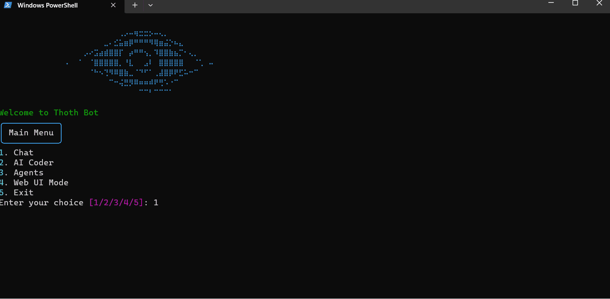

# Thoth-Bot

Thoth-Bot is a powerful AI assistant and code generation tool that combines natural language processing capabilities with advanced coding functionalities. It offers a versatile command-line interface for chatting with an AI, generating code, and managing AI agents.



## Features

- **AI Chat**: Engage in conversations with an advanced AI model, capable of answering questions and providing assistance on various topics.
- **Code Generation**: Automatically generate high-quality, well-structured Python code based on user instructions.
- **Code Improvement**: Analyze and improve existing code, fixing errors and enhancing functionality.
- **Multiple AI Models**: Choose from different AI models, including Llama 3.1 and Gemma, for various tasks.
- **Web UI Mode**: Launch a web-based user interface for enhanced interaction (in development).

## Technologies Used

- Python
- asyncio
- Groq API
- Rich (for console formatting)
- dotenv
- subprocess (for running generated code)

## Prerequisites

- Python 3.7 or later
- pip (Python package manager)

## Installation

1. Clone the repository:
   ```bash
   git clone https://github.com/yourusername/thoth-bot.git
   cd thoth-bot
   ```

2. Install dependencies:
   ```bash
   pip install -r requirements.txt
   ```

3. Set up your environment variables:
   Create a `.env` file in the root directory and add your Groq API key:
   ```
   GROQ_API_KEY=your_api_key_here
   ```

4. Run the main script:
   ```bash
   python main.py
   ```

## Usage

1. **Start the Bot**: Run `main.py` to launch Thoth-Bot.
2. **Choose a Mode**: Select from the following options:
   - **Chat**: Engage in a conversation with the AI.
   - **AI Coder**: Generate or improve Python code.
   - **Agents**: Manage AI agents (in development).
   - **Web UI**: Launch the web-based user interface (in development).

3. **Select an AI Model**: Choose from available models like Llama 3.1 or Gemma.
4. **Interact**: Follow the prompts to chat, generate code, or perform other tasks.

## Contributing

Contributions are welcome! Please feel free to submit a Pull Request.

## License

This project is licensed under the MIT License - see the [LICENSE](LICENSE) file for details.

## Acknowledgments

- [Groq](https://groq.com/) for providing the AI API.
- [Rich](https://github.com/Textualize/rich) for beautiful console formatting.
- [python-dotenv](https://github.com/theskumar/python-dotenv) for environment variable management.

## Author

<p align="left">
<b>Umutcan Edizaslan:</b>
<a href="https://github.com/U-C4N" target="blank"></a>
<a href="https://x.com/UEdizaslan" target="blank"></a>
</p>